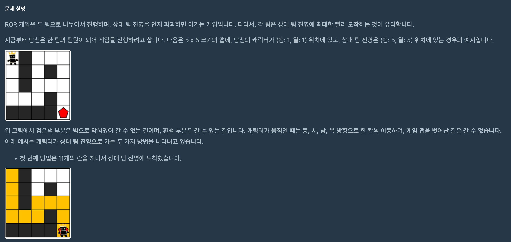
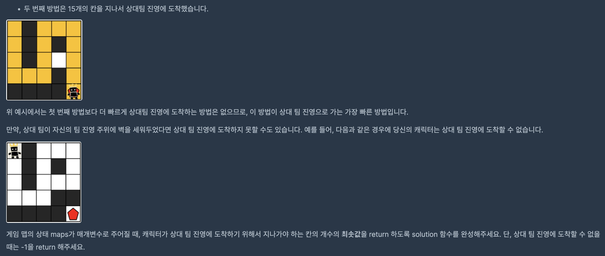

https://school.programmers.co.kr/learn/courses/30/lessons/1844?language=python3

### 해결방법

1. bfs 이용 (deque)

2. len(maps) 와 len(maps[0])를 통해 가로 세로 길이를 구함

3. 방문한 경로의 최소값을 저장할 visited 배열을 선언

4. 상하좌우에 대해 maps의 범위를 벗어나지 않았을 때, 방문한 적이 없다면 visited	 배열에 이전 위치 값 + 1 저장

5. 방문한 적이 있다면 이전 칸보다 값이 클 때만 visited 배열의 값 업데이트

6. visited[n-1][m-1] 출력

 
기본적인 bfs 문제 유형이다.

백준 문제들과 달리 프로그래머스 문제는 배열 미리 주어지므로 처음에 배열의 크기를 따로 구해주어야 한다.

효율성을 위해 느린 경로는 큐에 추가하지 않아 불필요한 연산을 줄여야 한다.