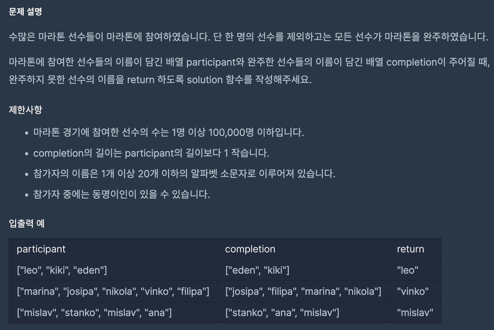

https://school.programmers.co.kr/learn/courses/30/lessons/42576?language=python3

## 완주하지 못한 선수

### 해결방법

1. 해싱 이용 (dictionary, hash)

2. hash 함수를 이용하여 participant 요소의 키 값과 요소를 dictionary에 저장

3. hash 값을 sumdict에 더해줌

4. completion에 포함된 요소를 hash 함수를 이용하여 키 값 추출 후 sumdict에서 빼줌

5. sumdict의 값이 남은 요소의 키 값이므로 dict[sumdict] 출력

 
해싱 문제는 dictionary를 이용해서 푸는 것이 효율성 측면에서 유리하다.

hash 함수를 이용하여 key 값을 추출할 수 있고 이것과 함께 value를 저장하면 해시테이블을 쉽게 만들 수 있다.