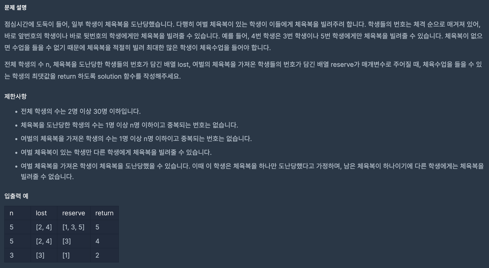

https://school.programmers.co.kr/learn/courses/30/lessons/42862?language=python3

## 체육복

### 해결 방법

1. 여벌의 체육복을 도난당한 학생을 카운트 할 수 없도록 lost와 reserve 배열에서 -1로 변경 후 카운트 +1

2. 이중 반복문을 통해 빌려줄 수 있는 경우 reserve 배열에서 -1로 변경 후 카운트 +1

3. 카운트 출력