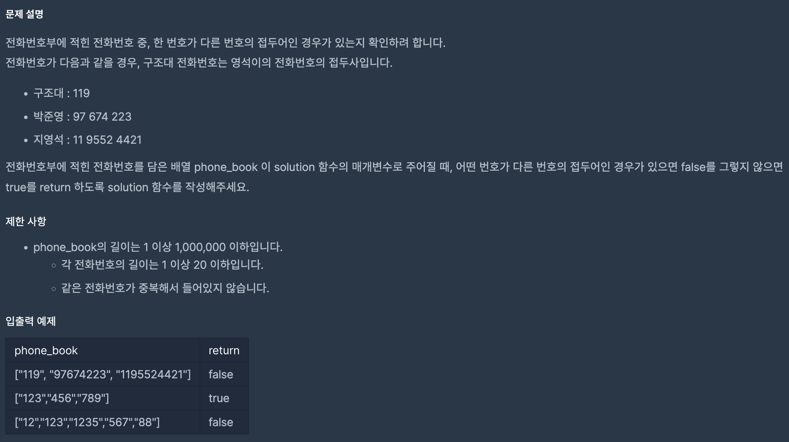

https://school.programmers.co.kr/learn/courses/30/lessons/42577?language=python3

## 전화번호 목록



### 해결방법

1. phone_book 정렬 -> 파이썬에서 숫자 문자열 리스트 정렬은 문자열 요소, 길이, 값의 크기 순서로 정렬된다.

2. phone_book의 현재 요소가 다음 요소의 접두어가 아니라면 그 다음 요소까지 확인할 이유가 없으므로 (1번을 이유로) 다음 요소와 비교

3. 접두어인지 확인해야 하므로 다음 요소를 이전 요소의 길이만큼 슬라이싱 해서 비교


#### 해시를 이용한 풀이
```
def solution(phone_book): 

    # 1.Hash map생성
    hash_map = {} 
    for nums in phone_book: 
        hash_map[nums] = 1 
    
    # 2.접두어가 Hash map에 존재하는지 찾기 
    for nums in phone_book: 
        arr = "" 
        for num in nums: 
            arr += num
    
            # 3. 본인 자체일 경우는 제외
            if arr in hash_map and arr != nums:       
                return False 
                
    return True
```
