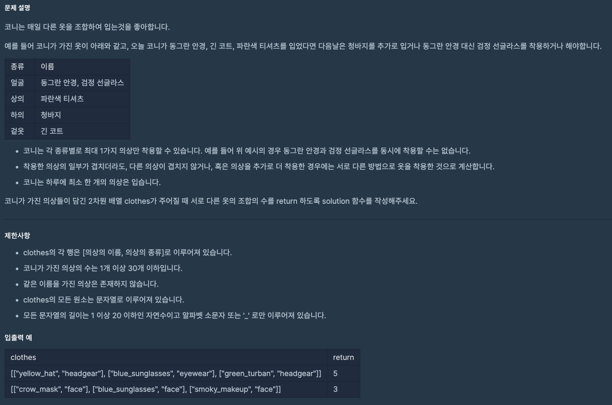

https://school.programmers.co.kr/learn/courses/30/lessons/42578?language=python3

## 의상



### 해결방법

1. 해싱 이용 (dictionary)

2. get 함수를 이용해서 키가 있을 땐 +1 값을 저장 아니라면 0을 저장하여 {key : value개수, ...} 형태로 저장

3. A의 종류가 N개, B의 종류가 M개 일 때 가능한 모든 경우의 수 (N+1)(M+1) 이므로 value + 1을 곱하여 결과 출력

<br>

참고한 풀이
```
def solution(clothes):
    # 각 종류별 가진 의상을 저장 (종류:[이름, 이름, ...])
    closet = {} 
    for name, kind in clothes:
        if kind in closet.keys():
            closet[kind] += [name]
        else:
            closet[kind] = [name]
    
    # A의 종류가 N개, B의 종류가 M개 일 때 가능한 모든 경우의 수 (N+1)(M+1)
    answer = 1
    for _, value in closet.items():
        answer *= (len(value) + 1)
        
    return answer -1
```

**dictionary는 {key : [value1, value2, ...], } 의 형태로 value를 배열의 형태로 저장할 수 있다.**

이 문제에서는 배열의 개수가 필요한 문제이므로 굳이 배열로 저장할 필요는 없다.