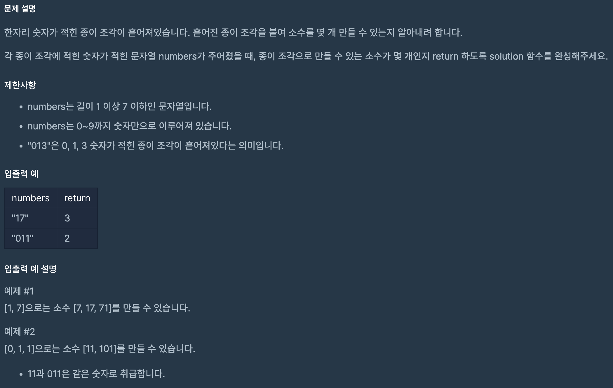

https://school.programmers.co.kr/learn/courses/30/lessons/42839

## 소수 찾기

### 해결방법

1. 브루트포스 문제 (모든 경우의 수 계산)

2. numbers를 리스트로 변환하며 한글자씩 분리한 후 permutations를 이용해 만들 수 있는 모든 경우의 수를 만듦

3. 튜플 형태로 되어있는 경우의 수를 합쳐 int로 변환하여 num에 저장

4. 에라토스테네스의 체 알고리즘을 이용하여 소수 판별

5. 겹치는 경우의 수 제거를 위해 set으로 변환 후 길이 반환

