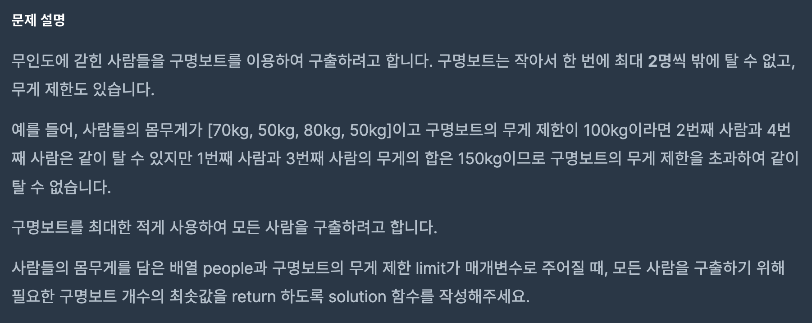

https://school.programmers.co.kr/learn/courses/30/lessons/42885

## 구명보트

### 해결방법

1. people 정렬 

2. 양 끝 사람의 합(무거운 사람, 가벼운 사람)이 limit를 넘으면 왼쪽 인덱스 증가

3. 넘지 않는다면 cnt(보트의 수) 증가

4. 왼쪽과 오른쪽의 인덱스가 같아지기 전까지 반복

5. 위 과정이 끝나면 len(people) - cnt 