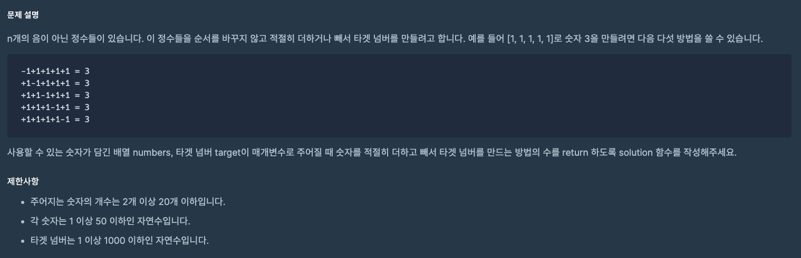

https://school.programmers.co.kr/learn/courses/30/lessons/43165?language=python3

### 해결방법

1. dfs를 이용

2. dfs 함수에 배열의 다음 인덱스 값을 더하는 호출과 빼는 호출 구현

3. index를 증가시키며 배열의 길이와 index값이 같아지면 return

 

target 값과 연산 결과가 같을 때 cnt 값을 매개변수로 전달하지 않고

solution 함수와 dfs 함수 내에서 global cnt 로 동일하게 선언하면 매개변수로 전달하지 않고 사용할 수 있다.