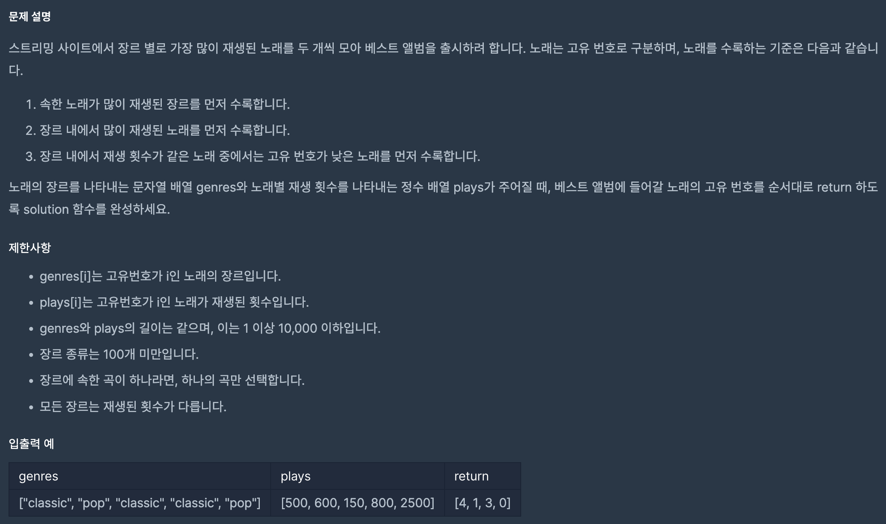

https://school.programmers.co.kr/learn/courses/30/lessons/42579

## 베스트 앨범

### 해결방법

1. 해시 이용(dictionary)

2. dict.get() 함수를 이용해 dict에 genres가 키 값으로 있다면 그 값과 plays 값을 더하여 저장 아닐 경우 0을 반환하도록 하여 plays 값과 더하여 저장

3. 동일한 반복문에서 genres의 우선순위와 순서를 저장하기 위해
  [genres[i], plays[i], i] 형태로 array 배열에 저장

4. dict는 value에 대해 내림차순 정렬, array는 장르 순서대로 정렬 후 plays 값에 대해 정렬

5. dict의 키와 array[0] 이 같고 cnt 값이 2를 넘어가지 않는다면 결과 배열에 append