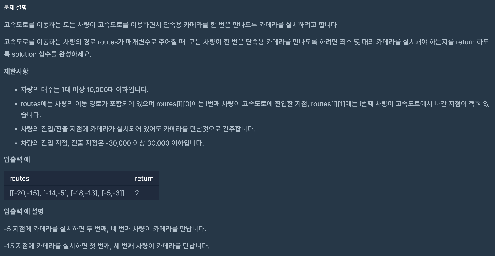

https://school.programmers.co.kr/learn/courses/30/lessons/42884

## 단속카메라



### 풀이방법

1. 그리디를 이용한 풀이

2. 고속도로 진입 순서로 정렬

3. 첫 카메라는 첫 고속도로 진입 자동차의 진출 지점으로 설정

4. 진출 시점이 이전 자동차 진출 이후라면 continue

5. 진출 시점이 이전 자동차 진출 이전이라면 카메라 위치를 현재 자동차의 진출 지점으로 변경

6. 진입 시점이 이전 자동차 진출 이후라면 카메라 위치를 현재 자동차의 진출 지점으로 카메라 추가

<br>

진입 시점으로 정렬하여 케이스를 나누어 해결했다.

진출 시점으로 정렬하면 더 간단하게 해결할 수 있다

```
def solution(routes):
    routes = sorted(routes, key=lambda x: x[1])
    last_camera = -30000

    answer = 0

    for route in routes:
        if last_camera < route[0]:
            answer += 1
            last_camera = route[1]

    return answer
```
