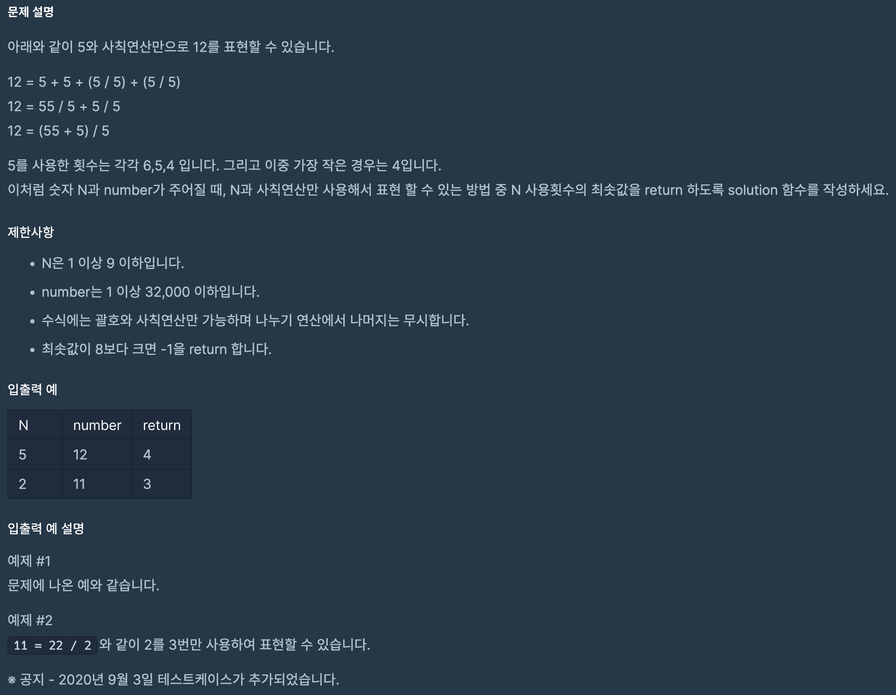

https://school.programmers.co.kr/learn/courses/30/lessons/42895

## N으로 표현

### 풀이방법

1. dp를 이용한 풀이

2. 연산 결과를 저장할 set 선언 (중복 결과 제거를 위해 set으로 선언)

3. N의 개수에 따라 연산

4. N이 1개일 때 dp[1] = {5+5, 5-5, 5//5, 5*5}, 2개일 때 dp[2] = {55, dp[1]에서 연산...}

5. int(str(N)* i)를 통해 NN 표현

6. 연산 후 결과에 number가 있으면 break 후 결과 반환

7. 아닐 시 dp배열에 추가하여 다음 연산 반복

