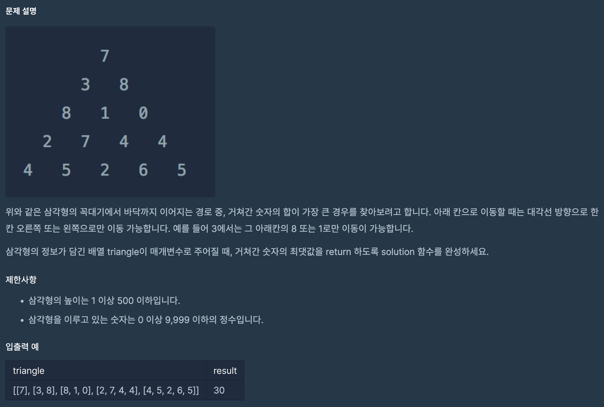

https://school.programmers.co.kr/learn/courses/30/lessons/43105?language=python3

## 정수 삼각형

### 해결방법

1. dp를 이용한 풀이 (botton-up)

2. triangle 배열을 복사하여 계산에 사용 (deepcopy)

3. 다음 경로에 대해서 [현재 요소에 다음 경로의 값을 더한 값]과 [다음 경로의 값] 중 더 큰 값을 다음 경로에 저장

4. 마지막 배열에서 최대값 반환

 

경로의 값이 변경되었을 떄 이전의 값을 사용하기 위해서 배열을 복사했다.

이 과정에서 효율성이 높지 않게 나왔다.

한 줄의 첫번째 경로, 마지막 경로, 중간에 겹치는 경로로 케이스를 나눠서 코드를 작성했을 때,

배열을 복사할 필요가 없기 때문에 높은 효율성으로 문제를 해결할 수 있다.