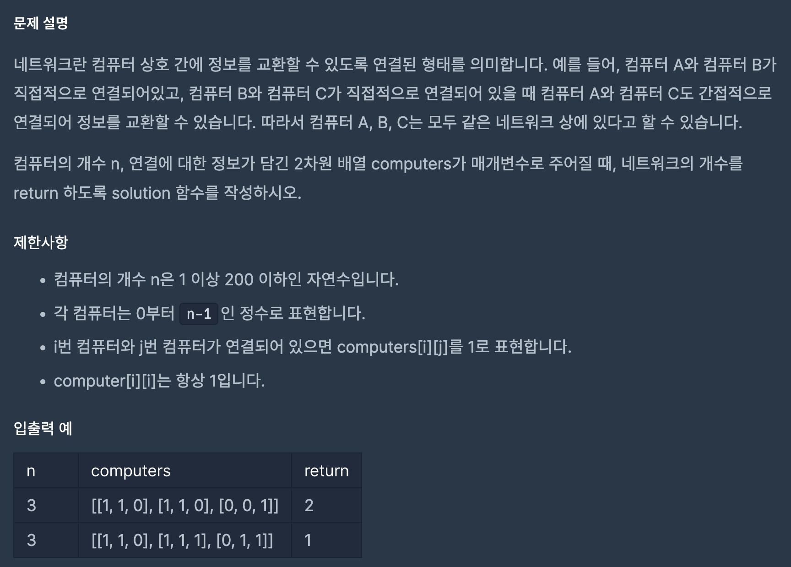

https://school.programmers.co.kr/learn/courses/30/lessons/43162

### 해결방법

1. bfs 이용(deque)

2. 방문한 컴퓨터를 저장할 배열 visited 선언

3. 반복문을 이용해서 순서대로 방문하지 않은 컴퓨터의 인덱스를 큐에 추가해준다(cnt + 1)

4. 큐에 인덱스가 있다면 bfs를 통해 하나의 네트워크 묶음을 찾음 이때 방문한 컴퓨터는 visited에서 True로 변경

5. 3 ~ 4를 반복하여 반복문이 종료되면 cnt를 출력

 

네트워크 개수를 찾기 위해 모든 노드를 방문해야하므로 n개의 배열을 모두 탐색해야한다.