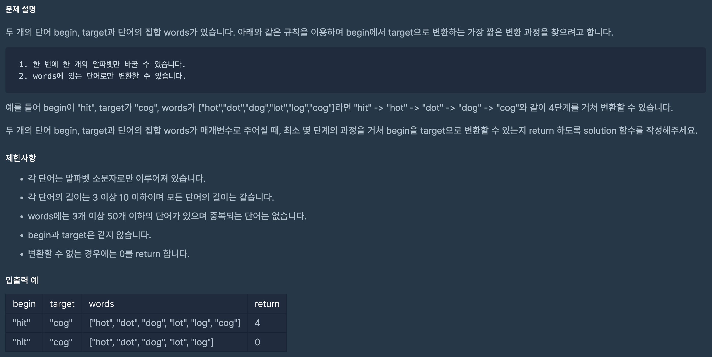

https://school.programmers.co.kr/learn/courses/30/lessons/43163

### 해결방법

1. bfs 이용 (deque)

2. target 단어가 words 배열에 없는 경우 0 반환

3. 큐에 [변환된 단어, 현재까지 변환 횟수] 를 저장

4. 큐에 저장되어 있던 변환된 단어와 words 배열의 단어를 순서대로 하나씩 비교

5. 한 알파벳만 다르다면 그 단어와 변환 횟수 + 1 을 큐에 저장

6. target 단어와 한 알파벳만 다르다면 변환 횟수 + 1 반환

7. 큐를 다 비워 while문이 끝났다면 target 단어로 변환 실패이기 때문에 0 반환